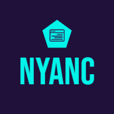

<a id="readme-top"></a>

<!-- PROJECT SHIELDS -->
[![Contributors][contributors-shield]][contributors-url]
[![Forks][forks-shield]][forks-url]
[![Stargazers][stars-shield]][stars-url]
[![Issues][issues-shield]][issues-url]
[![MIT License][license-shield]][license-url]
[![LinkedIn][linkedin-shield]][linkedin-url]

<!-- PROJECT LOGO -->
<br />
<div align="center">
  <a href="https://github.com/NyanPham/NyanC">
    
  </a>

<h3 align="center">NyanC</h3>

  <p align="center">
    Compiling C with purr-fect clarity.
    <br />
    <a href="https://github.com/NyanPham/NyanC"><strong>Explore the docs »</strong></a>
    <br />
    <br />
    <a href="https://github.com/NyanPham/NyanC">View Demo</a>
    ·
    <a href="https://github.com/NyanPham/NyanC/issues/new?labels=bug&template=bug-report---.md">Report Bug</a>
    ·
    <a href="https://github.com/NyanPham/NyanC/issues/new?labels=enhancement&template=feature-request---.md">Request Feature</a>
  </p>
</div>

<!-- TABLE OF CONTENTS -->
<details>
  <summary>Table of Contents</summary>
  <ol>
    <li>
      <a href="#about-the-project">About The Project</a>
      <ul>
        <li><a href="#built-with">Built With</a></li>
      </ul>
    </li>
    <li>
      <a href="#getting-started">Getting Started</a>
      <ul>
        <li><a href="#prerequisites">Prerequisites</a></li>
        <li><a href="#installation">Installation</a></li>
      </ul>
    </li>
    <li><a href="#usage">Usage</a></li>
    <li><a href="#roadmap">Roadmap</a></li>
    <li><a href="#contributing">Contributing</a></li>
    <li><a href="#license">License</a></li>
    <li><a href="#contact">Contact</a></li>
    <li><a href="#acknowledgments">Acknowledgments</a></li>
  </ol>
</details>

<!-- ABOUT THE PROJECT -->
## About The Project

This project is a C compiler built from the ground up in C++. It serves as a practical learning tool for understanding the core principles of compiler design, including lexical analysis, parsing, semantic analysis, and code generation. The codebase is structured to be as clear and understandable as possible, making it an excellent resource for anyone interested in learning how compilers work.

<p align="right">(<a href="#readme-top">back to top</a>)</p>

### Built With

* C++

<p align="right">(<a href="#readme-top">back to top</a>)</p>

<!-- GETTING STARTED -->
## Getting Started

To get a local copy up and running follow these simple example steps.

### Prerequisites

* A C++ compiler (e.g., g++, Clang)
* `make`

### Installation

1. Clone the repo
   ```sh
   git clone https://github.com/NyanPham/NyanC.git
   ```
2.  Navigate to the project directory:
    ```bash
    cd NyanC
    ```
3.  Build the compiler using the provided `Makefile`:
    ```bash
    make
    ```
    Alternatively, you can manually compile the source files:
    ```bash
    g++ -o nyanc.exe src/*.cpp -Isrc
    ```

<p align="right">(<a href="#readme-top">back to top</a>)</p>

<!-- USAGE EXAMPLES -->
## Usage

To compile a C program, use the following command:

```bash
./nyanc.exe <source_file.c> [options]
```

### Options

The compiler supports several options to control the compilation process:

*   `--lex`: Performs lexical analysis and prints the resulting tokens.
*   `--parse`: Performs parsing and prints the Abstract Syntax Tree (AST).
*   `--tacky`: Generates Tacky IR.
*   `--codegen`: Generates assembly code.
*   `--emit`: Generates an object file.
*   `--executable` (default): Generates an executable file.
*   `--debug`: Enables debug output.

<p align="right">(<a href="#readme-top">back to top</a>)</p>

## Compiler Stages

The NyanC compiler processes C code in several stages:

1.  **Lexical Analysis (`--lex`):** The source code is broken down into a series of tokens.
2.  **Parsing (`--parse`):** The tokens are used to build an Abstract Syntax Tree (AST), which represents the structure of the program.
3.  **Tacky IR Generation (`--tacky`):** The AST is converted into a Tacky Intermediate Representation (IR). This is a three-address code representation that is easier to optimize and translate to assembly.
4.  **Code Generation (`--codegen`):** The Tacky IR is translated into assembly code. This involves several steps:
    *   **CodeGen:** Translates Tacky IR into assembly with pseudo-registers.
    *   **ReplacePseudos:** Replaces pseudo-registers with stack-based memory access.
    *   **InstructionFixup:** Performs final adjustments to the assembly code.
5.  **Emitting Object File (`--emit`):** The assembly code is assembled into an object file.
6.  **Linking (`--executable`):** The object file is linked with the necessary libraries to create a final executable.

<p align="right">(<a href="#readme-top">back to top</a>)</p>

<!-- ROADMAP -->
## Roadmap

- [x] Generation of a Three-Address Code (TAC) Intermediate Representation (IR).
- [x] Support for unary, binary arithmetic, bitwise, logical, and relational operators.
- [x] Local variables 
- [x] Implementation of a semantic analysis phase.
- [x] Support if statements and conditional expressions
- [x] Support goto statements and labels
- [x] Implement loop statements (e.g., for, while, do-while)
- [x] Support global variables and multiple functions within a program.
- [ ] Support C types (e.g., double, pointers, arrays, strings, structs, unions).
  - [x] Signed Int.
  - [x] Signed Long.
  - [x] Unsigned Int.
  - [x] Unsigned Long.
  - [x] Double.
  - [x] Pointer.
  - [x] Array.
  - [x] Character, String.
  - [ ] Struct, Union
- [ ] Optimization passes on the TAC IR and code generation.

See the [open issues](https://github.com/NyanPham/NyanC/issues) for a full list of proposed features (and known issues).

<p align="right">(<a href="#readme-top">back to top</a>)</p>

<!-- CONTRIBUTING -->
## Contributing

Contributions are what make the open source community such an amazing place to learn, inspire, and create. Any contributions you make are **greatly appreciated**.

If you have a suggestion that would make this better, please fork the repo and create a pull request. You can also simply open an issue with the tag "enhancement".
Don't forget to give the project a star! Thanks again!

1. Fork the Project
2. Create your Feature Branch (`git checkout -b feature/AmazingFeature`)
3. Commit your Changes (`git commit -m 'Add some AmazingFeature'`)
4. Push to the Branch (`git push origin feature/AmazingFeature`)
5. Open a Pull Request

<p align="right">(<a href="#readme-top">back to top</a>)</p>

<!-- LICENSE -->
## License

Distributed under the MIT License. See `LICENSE` for more information.

<p align="right">(<a href="#readme-top">back to top</a>)</p>

<!-- CONTACT -->
## Contact

Nhàn Phạm - [LinkedIn](https://www.linkedin.com/in/nhan-pham-dev/) - phamthanhnhanussh@gmail.com

Project Link: [https://github.com/NyanPham/NyanC](https://github.com/NyanPham/NyanC)

<p align="right">(<a href="#readme-top">back to top</a>)</p>

<!-- ACKNOWLEDGMENTS -->
## Acknowledgments

* [Writing a C Compiler by Nora Sandler](https://norasandler.com/book/)

<p align="right">(<a href="#readme-top">back to top</a>)</p>

<!-- MARKDOWN LINKS & IMAGES -->
<!-- https://www.markdownguide.org/basic-syntax/#reference-style-links -->
[contributors-shield]: https://img.shields.io/github/contributors/NyanPham/NyanC.svg?style=for-the-badge
[contributors-url]: https://github.com/NyanPham/NyanC/graphs/contributors
[forks-shield]: https://img.shields.io/github/forks/NyanPham/NyanC.svg?style=for-the-badge
[forks-url]: https://github.com/NyanPham/NyanC/network/members
[stars-shield]: https://img.shields.io/github/stars/NyanPham/NyanC.svg?style=for-the-badge
[stars-url]: https://github.com/NyanPham/NyanC/stargazers
[issues-shield]: https://img.shields.io/github/issues/NyanPham/NyanC.svg?style=for-the-badge
[issues-url]: https://github.com/NyanPham/NyanC/issues
[license-shield]: https://img.shields.io/github/license/NyanPham/NyanC.svg?style=for-the-badge
[license-url]: https://github.com/NyanPham/NyanC/blob/master/LICENSE
[linkedin-shield]: https://img.shields.io/badge/-LinkedIn-black.svg?style=for-the-badge&logo=linkedin&colorB=555
[linkedin-url]: https://www.linkedin.com/in/nhan-pham-dev/
